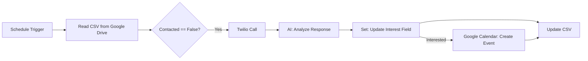

# AI-Agent for Automated Lead Generation via OpenAI Phone Call Assistant 

[](https://github.com/thisismohsinsyed)

## Overview

This repository contains an n8n workflow that automates the process of engaging and managing sales leads using an AI-powered pipeline. By integrating Google Drive, Twilio, OpenRouter, and Google Calendar, the system provides a scalable and efficient solution for lead qualification, contact, and meeting scheduling, with real-time data synchronization.

## Workflow Architecture

**Key Features:**

- **Automated Scheduling:**  
  The workflow is triggered every day at 9 AM, initiating the lead engagement process.

- **Dynamic Lead Filtering:**  
  Retrieves and filters leads from a Google Drive CSV, targeting only those who have not yet been contacted.

- **Voice Outreach via Twilio:**  
  Automatically calls leads using a Spanish voice script. The script can be dynamically generated or customized.

- **AI-Powered Response Analysis:**  
  Utilizes OpenRouter for evaluating call responses and determining the interest level of each lead.

- **Automated Calendar Booking:**  
  Interested leads are immediately scheduled for meetings in Google Calendar, considering timezone alignment (Europe/Madrid).

- **Continuous Data Update:**  
  Updates the CSV with the latest status, ensuring the dataset remains consistent for subsequent runs.

## Workflow Diagram



## Setup Instructions

1. **Clone this Repository**
   ```bash
   git clone https://github.com/thisismohsinsyed/lead-engagement-workflow.git
   ```

2. **Import the Workflow**
   - Open your n8n instance.
   - Import the provided JSON file (`lead-engagement-workflow.json`).

3. **Configure Credentials**
   - Add your credentials for Google Drive, Twilio, OpenRouter, and Google Calendar within n8n.
   - Update file paths, Twilio phone numbers, and API endpoints as needed.

4. **Customize Script & AI Logic**
   - Modify the voice call script and AI prompt according to your specific use case or localization requirements.

5. **Test & Deploy**
   - Run the workflow manually to validate integration.
   - Enable scheduling for fully automated operation.

## Repository Structure

```
.
├── lead-engagement-workflow.json    # n8n workflow file
├── README.md                       # Project documentation
```

## Applications

- Sales automation and CRM integration
- AI-powered lead qualification
- Automated outreach for research or event management
- Scalable marketing automation pipelines

## Author

**Syed Mohsin Ali Shah**  
Ph.D. Student and Research Scholar in Engineering (Air Pollution Monitoring, AI, Image Processing)  
GitHub: [thisismohsinsyed](https://github.com/thisismohsinsyed)

## License

This project is licensed under the MIT License.

---

**For questions, feature requests, or collaboration, feel free to open an issue or contact me directly.**
